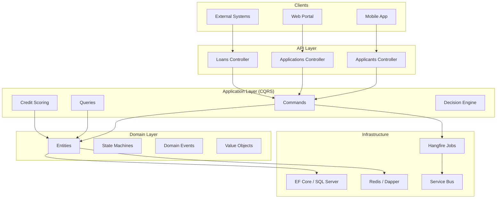
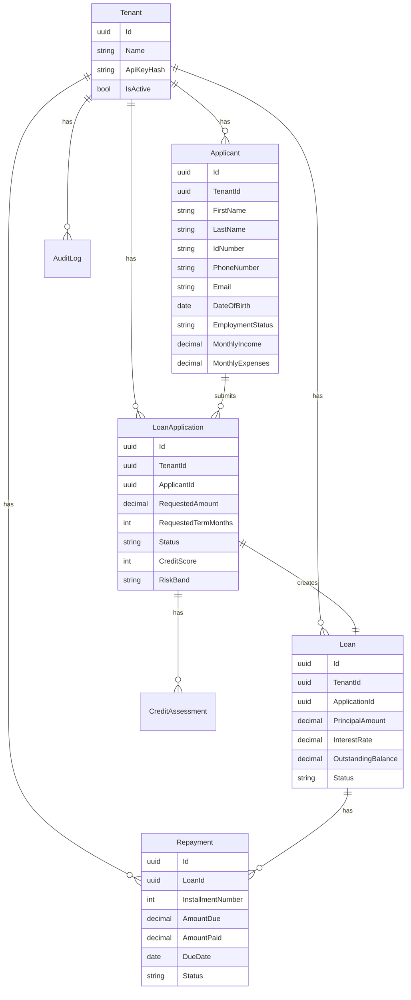
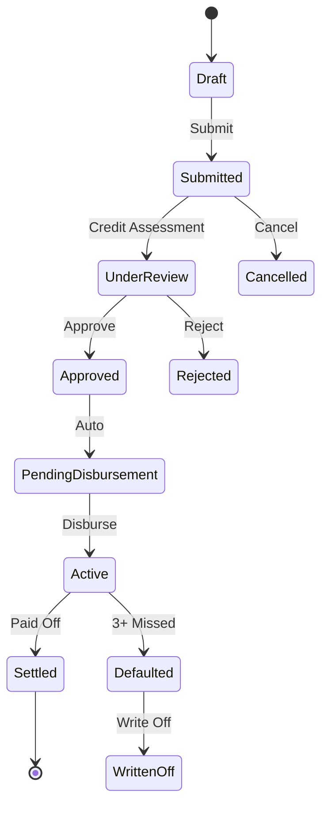
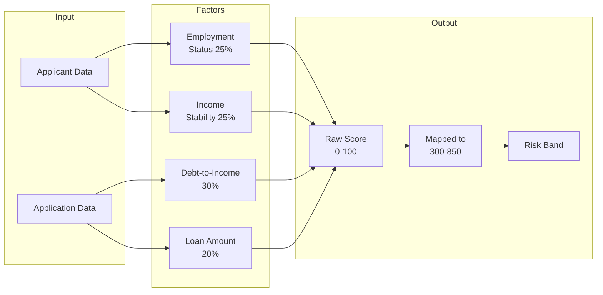
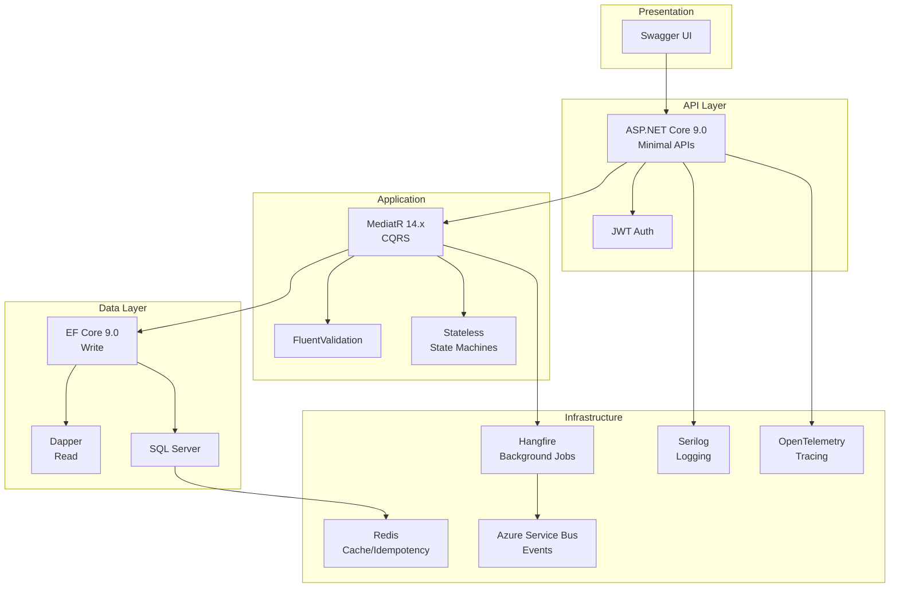

<!-- markdownlint-disable-next-line -->
<div align="center">

# LendFlow


**Enterprise-grade micro-lending API for South African lenders**

[Architecture](#-architecture) • [Features](#-features) • [Quick Start](#-quick-start) • [API](#-api-endpoints) • [Tech Stack](#-tech-stack)

</div>

---

## Overview

LendFlow is a **multi-tenant backend API** for managing the complete lifecycle of personal micro-loans. Built with Clean Architecture + CQRS pattern, designed for South African lending institutions with **POPIA**, **FICA**, and **NCA** compliance built-in.

### Key Capabilities

- ✅ Full loan lifecycle management
- ✅ Automated credit scoring (300-850 scale)
- ✅ Rule-based decision engine
- ✅ Idempotent financial operations
- ✅ Multi-tenancy from day one
- ✅ Comprehensive audit trail

---

## Architecture



---

## Entity Relationship



---

## Loan Lifecycle



---

## Credit Scoring Flow



---

## Features

### Core Features

| Feature | Description |
|---------|-------------|
| **Multi-Tenancy** | Multiple lenders on single platform with tenant isolation |
| **Credit Scoring** | Rule-based scoring with 4 weighted factors |
| **Decision Engine** | Auto-approve/reject + manual underwriter workflow |
| **State Machines** | Explicit state transitions for LoanApplication, Loan, Repayment |
| **Idempotency** | Redis-based idempotent keys prevent duplicate operations |
| **Audit Trail** | Append-only AuditLog with full history |

### Compliance

| Standard | Implementation |
|----------|---------------|
| **POPIA** | PII encrypted at rest (AES-256), 5-year retention, no PII in logs |
| **FICA** | SA ID validation (Luhn, DOB, gender, citizenship), audit trail |
| **NCA** | Min age 18, affordability check (DTI ≤ 40%), credit assessment |

---

## Quick Start

### Prerequisites

- .NET 9.0 SDK
- SQL Server 2022+ (or Docker)
- Redis 7.x

### Run with Docker

```bash
# Clone and navigate
cd LendFlow

# Start infrastructure
docker run -d --name lendflow-sql \
  -e "ACCEPT_EULA=Y" \
  -e "MSSQL_SA_PASSWORD=LendFlow@123" \
  -p 1433:1433 mcr.microsoft.com/mssql/server:2022-latest

docker run -d --name lendflow-redis -p 6379:6379 redis:alpine

# Run migrations and start API
dotnet ef database update
dotnet run --project LendFlow.Api
```

### Access

- **Swagger UI**: http://localhost:5147/swagger
- **Health Check**: http://localhost:5147/health

---

## API Endpoints

### Applicants

| Method | Endpoint | Description |
|--------|----------|-------------|
| POST | `/api/v1/applicants` | Register new applicant |
| GET | `/api/v1/applicants/{id}` | Get applicant details |

### Loan Applications

| Method | Endpoint | Description |
|--------|----------|-------------|
| POST | `/api/v1/applications` | Submit loan application |
| GET | `/api/v1/applications` | List applications |
| GET | `/api/v1/applications/{id}` | Get application details |
| POST | `/api/v1/applications/{id}/assess` | Trigger credit assessment |
| POST | `/api/v1/applications/{id}/decision` | Manual decision |
| POST | `/api/v1/applications/{id}/cancel` | Cancel application |

### Loans

| Method | Endpoint | Description |
|--------|----------|-------------|
| GET | `/api/v1/loans` | List loans |
| GET | `/api/v1/loans/{id}` | Get loan details |
| POST | `/api/v1/loans/{id}/disburse` | Disburse loan |
| GET | `/api/v1/loans/{id}/repayments` | Get repayment schedule |
| POST | `/api/v1/loans/{id}/repayments/pay` | Record repayment |

---

## Tech Stack



| Component | Technology |
|-----------|------------|
| Framework | ASP.NET Core 9.0 |
| Language | C# / .NET 9.0 |
| ORM | Entity Framework Core 9.0 |
| Query | Dapper |
| Database | SQL Server |
| Cache | Redis |
| CQRS | MediatR 14.x |
| Validation | FluentValidation |
| State Machines | Stateless |
| Background Jobs | Hangfire |
| Messaging | Azure Service Bus |
| Auth | JWT Bearer |

---

## Project Structure

```
LendFlow/
├── LendFlow.slnx
├── appsettings.json
├── README.md
├── spec.md
├── DOCUMENTATION.md
│
├── LendFlow.Api/                # Entry point
│   ├── Controllers/
│   ├── Middleware/
│   ├── Models/
│   └── Program.cs
│
├── LendFlow.Application/       # CQRS layer
│   ├── Commands/
│   ├── Queries/
│   ├── CreditScoring/
│   └── Common/
│
├── LendFlow.Domain/           # Domain logic
│   ├── Entities/
│   ├── Enums/
│   ├── Events/
│   └── ValueObjects/
│
├── LendFlow.Infrastructure/    # Data & external
│   ├── Persistence/
│   ├── Services/
│   └── Migrations/
│
└── LendFlow.Tests/            # Unit tests
    ├── Commands/
    ├── Queries/
    └── Validators/
```

---

## Testing

```bash
cd LendFlow
dotnet test
```

```
Test run for LendFlow.Tests/bin/Debug/net9.0/LendFlow.Tests.dll
Passed!  - Failed: 0, Passed: 8, Skipped: 0, Total: 8
```

---

## Contributing

1. Fork the repository
2. Create a feature branch (`git checkout -b feature/amazing-feature`)
3. Commit changes (`git commit -m 'Add amazing feature'`)
4. Push to branch (`git push origin feature/amazing-feature`)
5. Open a Pull Request

---

## License

MIT License - See [LICENSE](LICENSE) file for details.

---

## Authors

Built with ❤️ by [DynamicKarabo](https://github.com/DynamicKarabo)

[](https://github.com/DynamicKarabo)

